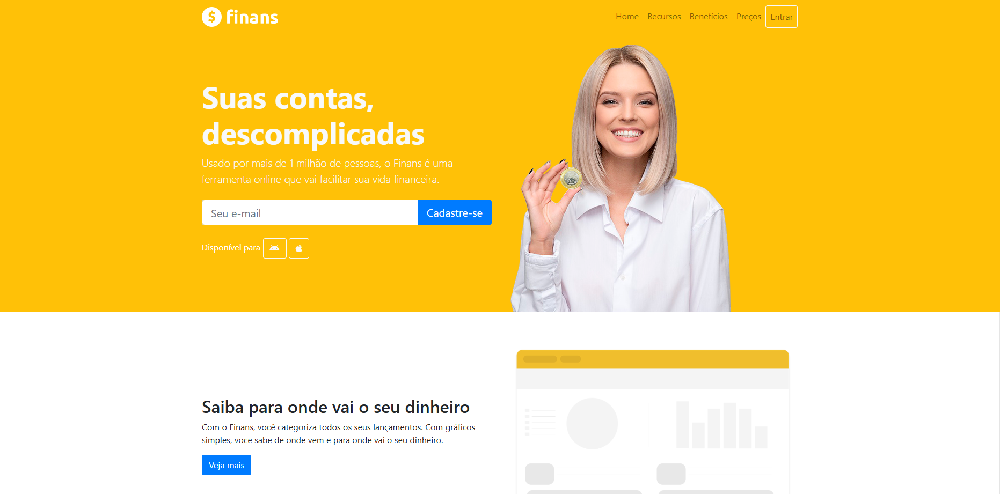

# Finans - Finanças Pessoais

Finans é uma aplicação web simples e intuitiva para controle de finanças pessoais. O objetivo é ajudar usuários a organizarem suas contas, acompanharem gastos e receitas, e manterem suas finanças sob controle de forma prática e visual.

## Índice

- [Demonstração](#demonstração)
- [Funcionalidades](#funcionalidades)
- [Tecnologias Utilizadas](#tecnologias-utilizadas)
- [Estrutura do Projeto](#estrutura-do-projeto)
- [Como Usar](#como-usar)
- [Personalização](#personalização)
- [Licença](#licença)
- [Contato](#contato)

---

## Demonstração

Acesse a aplicação localmente abrindo o arquivo [`index.html`](index.html) no seu navegador.

---

## Funcionalidades

- **Cadastro de e-mail:** Formulário para cadastro rápido de e-mail.
- **Navegação intuitiva:** Menu superior com links para Home, Recursos, Benefícios, Preços e Entrar.
- **Apresentação dos recursos:** Seções explicativas sobre funcionalidades, benefícios e diferenciais do Finans.
- **Design responsivo:** Layout adaptável para diferentes tamanhos de tela, utilizando Bootstrap.
- **Ícones modernos:** Uso de ícones FontAwesome para melhor visualização.
- **Imagens ilustrativas:** Imagens que facilitam o entendimento das funcionalidades.
- **Links para redes sociais:** Acesso rápido para YouTube, Instagram e LinkedIn.

---

## Tecnologias Utilizadas

- **HTML5:** Estruturação da página.
- **CSS3:** Estilização personalizada em [`css/style.css`](css/style.css).
- **Bootstrap:** Framework para design responsivo e componentes prontos.
- **FontAwesome:** Ícones modernos e de fácil utilização.

---

## Estrutura do Projeto
├── index.html ├── css/ │ ├── bootstrap.min.css │ └── style.css ├── fontawesome-web/ │ ├── css/ │ └── ... ├── img/ │ ├── capa-mulher.png │ ├── economize.png │ ├── facil.png │ ├── juros.png │ ├── logo.png │ ├── saiba.png │ └── suporte.png └── ...

- **index.html:** Página principal da aplicação.
- **css/:** Arquivos de estilos.
- **fontawesome-web/:** Arquivos de ícones.
- **img/:** Imagens utilizadas no site.

---

## Como Usar

1. **Clone ou baixe este repositório.**
2. **Abra o arquivo [`index.html`](index.html) em seu navegador.**
3. **Navegue pelas seções para conhecer os recursos do Finans.**
4. **Personalize conforme sua necessidade (veja abaixo).**

---

## Personalização

- **Imagens:** Substitua as imagens na pasta [`img/`](img/) para alterar a identidade visual.
- **Cores e estilos:** Edite o arquivo [`css/style.css`](css/style.css) para mudar cores, fontes e espaçamentos.
- **Conteúdo:** Modifique os textos no [`index.html`](index.html) para adaptar à sua proposta.

---

## Licença

Este projeto utiliza ícones FontAwesome sob sua respectiva licença ([fontawesome-web/LICENSE.txt](fontawesome-web/LICENSE.txt)). O restante do código pode ser utilizado livremente para fins de estudo.

---